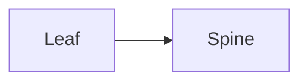

# Deck visual system — design tokens

One restrained dark palette shared by **Marp slides**, **Mermaid diagrams**, and **plots**.
Neutral graphite surfaces; **lime (`#76B900`) reserved as the single focal accent**
so it actually reads as emphasis. This file is the source of truth — change a color here,
then update the three consumers below.

## Palette

| Token          | Hex        | Where it's used                                        |
|----------------|------------|--------------------------------------------------------|
| `bg/slide`     | `#0B0F14`  | Slide background; edge-label background                 |
| `surface/node` | `#161B22`  | Default diagram node / box fill; slide surfaces         |
| `surface/alt`  | `#0E141B`  | Subgraph / cluster background                           |
| `panel/code`   | `#10161D`  | Code blocks, table headers                              |
| `border`       | `#3A424C`  | Node borders                                            |
| `border/dim`   | `#30363D`  | Cluster / table borders                                 |
| `line`         | `#8B949E`  | Diagram edges / connectors                              |
| `text`         | `#E6EDF3`  | Primary text                                            |
| `text/muted`   | `#9DA7B0`  | Secondary text, pagination, axis ticks                  |
| **`accent`**   | `#76B900`  | lime — headings, rules, focal node/edge, series-1|
| `accent/dim`   | `#5A7D1F`  | Bullet markers, quiet accents                           |
| `accent/fill`  | `#14300A`  | Fill behind an accented node                            |
| `accent/text`  | `#DBF3B0`  | Text on accent; inline code                             |
| `link`         | `#8FD13F`  | Hyperlinks                                              |
| series 2–5     | `#4CC9F0` `#E0A030` `#C77DFF` `#FF6B6B` | Extra categorical colors (charts, multi-role diagrams) |

**Font stack:** `Inter, "Segoe UI", "DejaVu Sans", sans-serif` (Chromium falls back to
DejaVu Sans, which is installed — replaces Mermaid's default Trebuchet).

## Consumers

- **Mermaid** → `assets/mermaid-theme.json`, passed to `mmdc -c`. `htmlLabels:false` so
  labels are native SVG text (renders in every consumer, not just Chromium).
- **Marp** → `assets/theme-midnight-dark.css` (`/* @theme midnight-dark */`), passed to
  `marp --theme-set`. Decks set `theme: midnight-dark` in frontmatter.
- **Plots** → `assets/midnight-dark.mplstyle` (`plt.style.use(...)`), saved transparent.

## Accent convention (diagrams)

Keep nodes neutral. To emphasize the one focal element, tag it `:::accent` — it renders in
the lime accent. Never hand-write color hex inside a diagram; the theme owns color.

