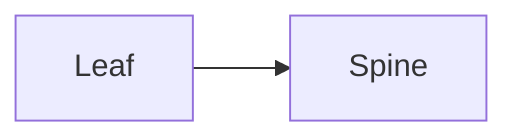
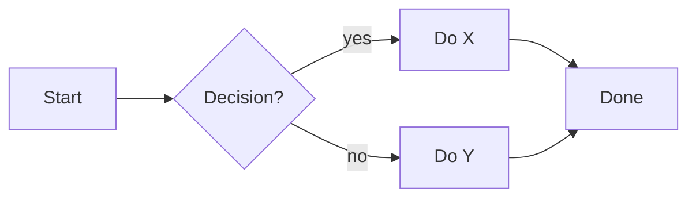
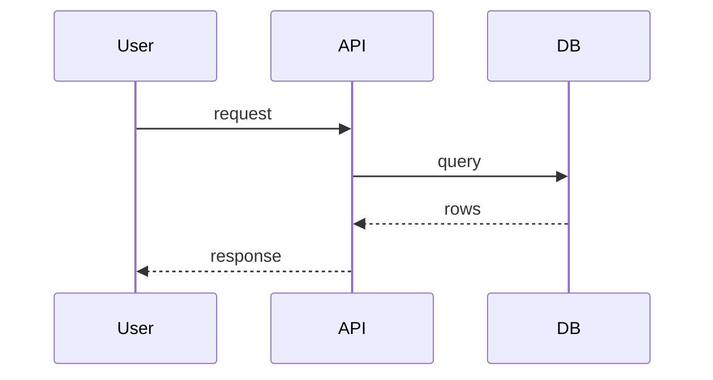
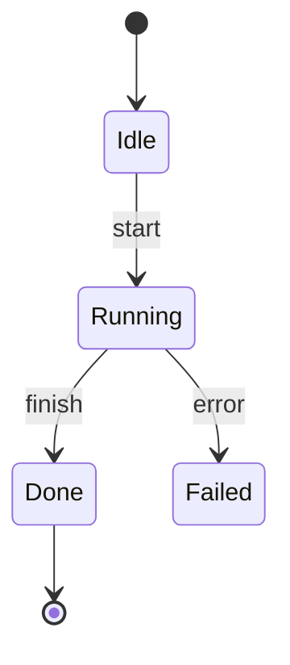
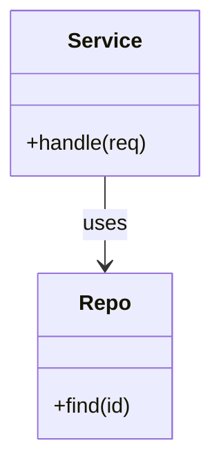
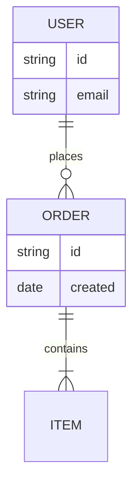
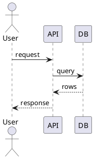

# Diagram cheat-sheet — when to draw, and the syntax to copy

A presentation is clearer with a **diagram** than with bullets whenever the content is
*structural* rather than narrative. Detect that from the evidence, pick a type from the
table, and paste the matching skeleton into a slide. Default notation is **Mermaid**
(renders in GitHub/VS Code `.md` preview and, via `render_diagrams.sh`, in the exported deck).

## Decision guide — content → diagram type

| If the evidence describes…                                             | Use            |
|------------------------------------------------------------------------|----------------|
| Components / services / modules and **how they connect**               | flowchart or class/component |
| **Messages/steps between actors** over time (client↔server, call flow) | sequence       |
| A **process / pipeline / decision flow** ("first… then… if…")          | flowchart      |
| **States and transitions** (a machine, a lifecycle, a status field)    | state          |
| **Entities and relationships** (a data model, tables, schema)          | ER (erDiagram) |
| Class hierarchy / types / fields & methods                             | classDiagram   |

If nothing is structural, **skip diagrams** — do not force one. Only draw what the evidence
actually supports (the transcript said it or the OCR/slides showed it).

## ⚠ Mermaid label rule (avoids parse errors)

**Always double-quote node label text.** Parentheses, brackets, colons, `#`, or `/` inside an
*unquoted* node label break the Mermaid parser (`Parse error … got 'PS'`). Quote the text:

```
Right:  C["slurmctld (controller)"]      U["User"] -->|commands| C["slurmctld (controller)"]
Wrong:  C[slurmctld (controller)]        (raw parens inside [...] → parse error)
```

This applies to every node shape — `["…"]`, `("…")`, `{"…"}`, `(["…"])`. When in doubt, quote it.
Edge labels use `-->|text|` and are fine unquoted, but avoid parens there too.

**Never put `;` inside a message or Note label.** Mermaid treats `;` as a statement separator
even inside `A->>B: text` and `Note over A,B: text`, so `R->>F: Remove key; release resources`
parses `release resources` as a new (broken) statement → `Parse error … got 'NEWLINE'`. Use a
comma or dash instead:

```
Right:  R->>F: Remove key, release resources        Note over A,B: forwards traffic, keeps paths
Wrong:  R->>F: Remove key; release resources        Note over A,B: forwards traffic; keeps paths
```

(A trailing `;` on a `classDef`/`style`/`linkStyle` line is fine — the rule is about label text.)

**Line breaks:** use `<br/>` inside a label, never `\n` (Mermaid prints `\n` literally):

```
Right:  D["Data Center<br/>DGX A100/H100"]
Wrong:  D["Data Center\nDGX A100/H100"]
```

**Thick/labelled edges need the arrow:** `A ==label==> B`. A bare `A == label == B` (no `>`) is a
lexical error:

```
Right:  L["Leaf"] ==BGPv6==> R["Spine"]
Wrong:  L["Leaf"] == BGPv6 == R["Spine"]
```

## Color & the accent convention

**Do not put color hex in diagrams.** The Midnight-dark theme is applied automatically at
render (`assets/mermaid-theme.json` via `mmdc -c`): graphite nodes, gray edges, light text,
lime highlights on sequence actors/notes. Decks render on dark slides
(`theme: midnight-dark`), so diagrams are drawn transparent and sit on the slide.

Keep nodes **neutral**. To emphasize the one focal element, tag it `:::accent` — it renders
in the lime accent. That's the only styling you add by hand:



Reserve the accent for a single focal node per diagram, or the green loses its meaning.
Full palette: `assets/design-tokens.md`.

## Mermaid skeletons (copy, then fill in)

Flowchart (process / architecture):


Sequence (interactions over time):


State (state machine / lifecycle):


Class / component (types, modules, relations):


ER (data model):


## PlantUML alternative
If you prefer PlantUML, fence with ```plantuml and `render_diagrams.sh` renders it via the
`plantuml` CLI. `@startuml`/`@enduml` are added automatically if you omit them.


## Rendering
`scripts/render_diagrams.sh deck.md` turns these fenced blocks into `diagrams/dNN.svg` and
swaps in image references so they appear in the PPTX/PDF. Without the renderer installed the
fenced blocks are left as-is and still render in any Markdown preview.
