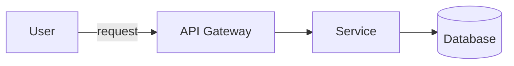
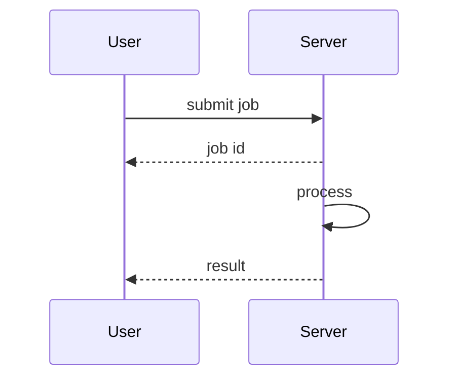

<!--
This is a Marp deck skeleton. Rules for the agent filling it in:
- One "---" line separates slides.
- Slide 1 = title. Then ~1 slide per topic from the transcript/OCR.
- Bullets are terse (<= ~10 words). Put detail in speaker notes (HTML comment).
- Cite the source moment with a [HH:MM:SS] tag when a claim comes from a specific point.
- Reference a keyframe image when it adds signal:  
- For STRUCTURAL topics, use a diagram slide instead of bullets (see the two examples below
  and references/diagrams-cheatsheet.md). Delete the examples you don't use.
- Only include what the evidence supports. Do not invent facts.
-->

# <Presentation Title>

<Subtitle / one-line summary of the video>

<!-- Speaker notes: source video filename, duration. -->

---

## <Topic 1>

- <key point>            <!-- [00:01:20] -->
- <key point>
- <key point>

<!-- Speaker notes: fuller explanation drawn from the transcript. -->

---

## <Architecture / structural topic — example diagram slide>

<!-- Use when the content describes components and how they connect. -->

---

## <Interaction over time — example sequence slide>

<!-- Use when the content describes messages/steps between actors. -->

---

## Summary

- <takeaway 1>
- <takeaway 2>
- <takeaway 3>
